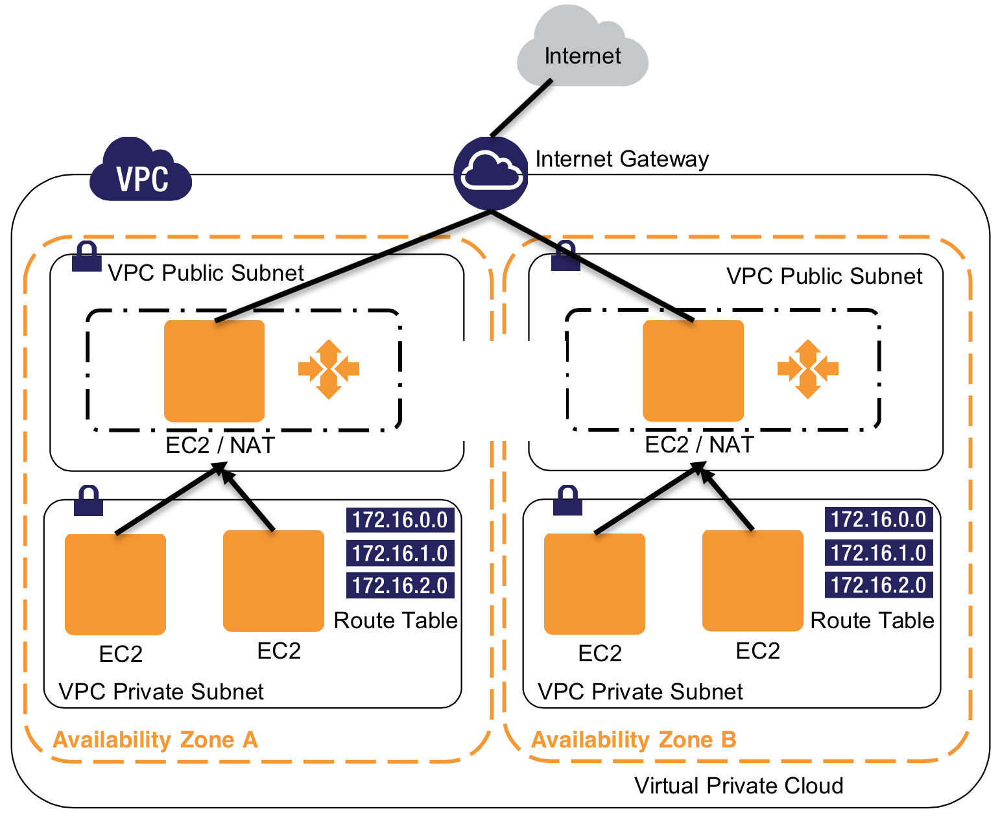

# Stax

## About

Create stacks (aka stax) on AWS ([Amazon Web Services](aws.amazon.com)) in a private VPC (Virtual Private Cloud) with failover NAT nodes proxying network traffic to elastic [CoreOS](https://coreos.com/) clusters running Docker. Some of the ideas can be seen in this image.



## Requirements

### Client

* Stax runs on Linux (tested on Debian GNU/Linux and Ubuntu, others should work too) and Apple OS X (tested on 10.10 and 10.9).

### Curl

* Install [curl](http://curl.haxx.se/) if you don't already have it installed (OS X has it by default, and most Linux distros have it by default) on your client.

```bash
apt-get install curl   # Debian GNU/Linux, Ubuntu
yum install curl       # Red Hat Enterprise Linux (RHEL), CentOS, Amazon Linux
```

### aws-cli

* Install [aws-cli](https://github.com/aws/aws-cli) (Universal Command Line Interface for Amazon Web Services) on your client.

```bash
apt-get install awscli  # Debian GNU/Linux, Ubuntu
brew install aws-cli    # Apple OS X ([via Homebrew](http://brew.sh/))
yum install awscli      # Red Hat Enterprise Linux (RHEL), CentOS, Amazon Linux
```

* Configure the aws client with your AWS credentials. Find yours from the [users page](https://console.aws.amazon.com/iam/home#users) on the AWS Console. Choose your username, scroll down to Security Credentials > Access Credentials > Access Keys, and click Manage Access Keys.

```bash
aws configure
```

You will be prompted to enter your AWS access key and secret access key, and will write and store them in ~/.aws/credentials.

### AWS Key Pair

* Create a new Key Pair so aws-cli can talk to AWS. From the [AWS Console](https://console.aws.amazon.com/ec2/v2/home) navigate to EC2 > Netork & Security > Key Pairs > Create Key Pair
* Name it whatever you want, click 'Create'
* It will create a new Key Pair and automatically download it
* Move the new keypair into the .ssh directory in your home directory

```bash
mv ~/Downloads/NEW_KEY_PAIR.pem ~/.ssh
```

## Usage

* To get started, clone stax

```bash
git clone https://github.com/philcryer/stax
cd stax
```

* Copy the example config file

```bash
cp config/config.json.example config.json
```

* Configure the config file replacing all instances of [<changeMe]. Notice the cluster size option that defines the minimal amount of CoreOS nodes running, start with [2] for now.

```bash
vi config.json
```

* Run stax

```bash
$ stax
Usage: stax <command>

Commands:
  list          List all currently built and running stax
  create        Create a new VPC stax in AWS
  describe      Describe the created VPC stax
  connect       Connect to the jumpbox in the VPC stax over SSH
  destroy       Destroy the existing VPC stax
```

* Create a stax cluster on AWS

```bash
stax create
```

Watch for any errors.

## Accessing the cluster

* It will take ~5 minutes to build, you can check the status in the AWS console, or just try to connect with stax.

```bash
stax connect
```

The command will check if the cluster is built, and if it is, it will populate the jumpbox with needed information and then connect you to it.

* Once on the jumpbox you can get to randomly available CoreOS/Docker host with the dockconnect command.

```bash
dockconnect
```

* Once on a CoreOS/Docker host see if fleet can see the other Docker hosts.

```bash
fleetctl list-machines
```

* Example output
```bash
[ec2-user@ip-10-183-1-99 ~]$ dockconnect
CoreOS (alpha)
core@ip-10-183-2-219 ~ $
core@ip-10-183-2-219 ~ $ fleetctl list-machines
MACHINE   IP    METADATA
057d212e... 10.183.0.16 -
4f622c15... 10.183.2.219  -
```

Ta... da.

## Destroyng the cluster

* To delete the cluster, as well as the cloudformation scripts, security groups, etc that it created.

```bash
stax destroy
```

## Other details

* The stax configuration is handled by Cloud Formation scripts, see them in the templates directory.
* Services installed on CoreOS are etcd and fleet by default.
* Future plans call for use of an orchestrator to run Docker instances across the cluster using fleet (or something else).

## Acknowledgements

The stax project started off with ideas from the following projects, thanks!

    https://github.com/emmanuel/coreos-skydns-cloudformation
    https://github.com/philcryer/coreos-aws-cloudformation
    https://github.com/kelseyhightower/kubernetes-coreos

## License

The MIT License (MIT)

Copyright (c) 2015 philcryer

Permission is hereby granted, free of charge, to any person obtaining a copy
of this software and associated documentation files (the "Software"), to deal
in the Software without restriction, including without limitation the rights
to use, copy, modify, merge, publish, distribute, sublicense, and/or sell
copies of the Software, and to permit persons to whom the Software is
furnished to do so, subject to the following conditions:

The above copyright notice and this permission notice shall be included in all
copies or substantial portions of the Software.

THE SOFTWARE IS PROVIDED "AS IS", WITHOUT WARRANTY OF ANY KIND, EXPRESS OR
IMPLIED, INCLUDING BUT NOT LIMITED TO THE WARRANTIES OF MERCHANTABILITY,
FITNESS FOR A PARTICULAR PURPOSE AND NONINFRINGEMENT. IN NO EVENT SHALL THE
AUTHORS OR COPYRIGHT HOLDERS BE LIABLE FOR ANY CLAIM, DAMAGES OR OTHER
LIABILITY, WHETHER IN AN ACTION OF CONTRACT, TORT OR OTHERWISE, ARISING FROM,
OUT OF OR IN CONNECTION WITH THE SOFTWARE OR THE USE OR OTHER DEALINGS IN THE
SOFTWARE.

## Stax Studio

* Stax, besides being a clever take on the word stacks, is named after the famous Stax Recording Studio in Memphis, TN. If you're ever in Memphis, visit the awesome [Stax Museum](http://www.staxmuseum.com/)... it's far more interesting than Sun Studios, but I digress.


